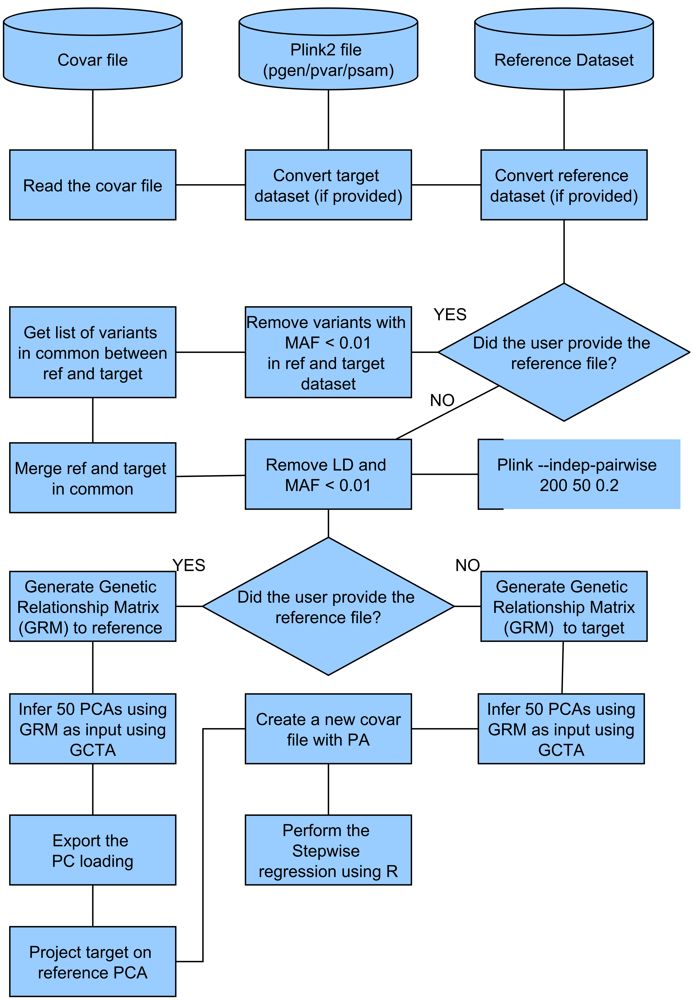

# Projected PCA and Model Selection



## covarProjectedPCA.py

This script performs all steps to conduct a projected or non-projected PCA using GCTA. 

To perform a projected PCA, please provide a file using the -R flag. If you desire a non projected PCA, please do not provide any file to -R.
The input requires at least the -A (autosomal file) and the covar file (tsv file). 

## Example of command line

```
python covarProjectedPCA.py \
   -A /home/peixott/beegfs/Analysis/DataClean/CleanData/LARGE_NewPipeline/FinalData/LARGE_Phase2_QCed_Autosomal \
   -t covar.txt -R /home/peixott/beegfs/Analysis/DataClean/CleanData/Shriner/OneThousand_All \
   -n LARGE_TryNew -f ./NewPCs_OutModel \
   --gcta /home/peixott/beegfs/Programs/gcta-1.94.1-linux-kernel-3-x86_64/gcta64 \
   --selectModel ./selectModel.R --plink1 plink --plink2 /home/peixott/beegfs/Programs/plink2
```

## Parameters

```
PCA and regression

options:
  -h, --help            show this help message and exit

Data arguments:
  -A AUTOSOMAL, --autosomal AUTOSOMAL
                        Genotyped file name for autosomal chromosome
  -t TABLECOVAR, --tableCovar TABLECOVAR
                        File with covariatives to be added to the model
  --threads THREADS     Number of processors to be used (default = 1)

Reference data arguments:
  -R AUTOSOMALREF, --AutosomalRef AUTOSOMALREF
                        Data with parental reference data to run autosomal PCA (optional)

Output arguments:
  -n NAME, --name NAME  Analysis name
  -f FOLDER, --folder FOLDER
                        Folder to output files

PCA arguments:
  --model MODEL [MODEL ...]
                        Regression model. If you do not provide a model the script will use the selectModel.R to build the model

Programs:
  --plink2 PLINK2       Path of PLINK 2 (default = plink2)
  --plink1 PLINK1       Path of PLINK 1 (default = plink)
  --gcta GCTA           Path of gcta
  --selectModel SELECTMODEL
                        Path of selectModel script
```

## selectModel.R

This script is used by covarProjectedPCA.py to perform the stepwise regression (using MASS library) in order to obtain the best set of covariates to be 
used in your GWAS (it will be a file with suffix _variables.tsv). There is a huge debate
if it is ok you let your set of covariates being decided by an automated program.

## PCAPlot.py

Script to generate a GGPlot2 based script to plot GWAS. 


## Acknowledgements
This work is supported by NIH Grant R01 1R01NS112499-01A1, MJFF Grant ID: 18298, ASAP-GP2 and Parkinson's Foundation

# Contact
Created by Thiago Peixoto Leal. PhD ([PEIXOTT@ccf.org](PEIXOTT@ccf.org) or [thpeixotol@hotmail.com](thpeixotol@hotmail.com))

# Need to create the fluxogram